# AutoSumo Web Frontend

Web interface using [Google Blockly](https://developers.google.com/blockly) to generate and upload javascript code to
the [AutoSumo code server](https://github.com/AutoSumo/code-server).

Includes robot-specific blocks and example code to drive around the arena. Blocks automatically get highlighted as the robot executes the instructions.

```mermaid
flowchart TD
    web["🌐 Web Interface\n(this)"] -->|uploads code| code-server[("💾 Code Server")]
    code-server -->|highlight data| web
    code-server -->|downloads code| bot-server["💻 Bot Server"]
    bot-server -->|highlight data| code-server
    bot-server -->|motor instructions| robot["🤖 Robot"]
    robot -->|sensor data| bot-server
    tag-server["📷 Tag Server"] -->|apriltag positions| bot-server
    
    style web stroke-width:2px,stroke-dasharray: 5 5,stroke:#3b82f6
    
    click code-server "https://github.com/AutoSumo/code-server"
    click bot-server "https://github.com/AutoSumo/server"
    click robot "https://github.com/AutoSumo/robot"
    click tag-server "https://github.com/AutoSumo/tag-server"
```

https://user-images.githubusercontent.com/26680599/185769401-c024f6a5-496c-4001-9858-a5e7ccef9a41.mp4
